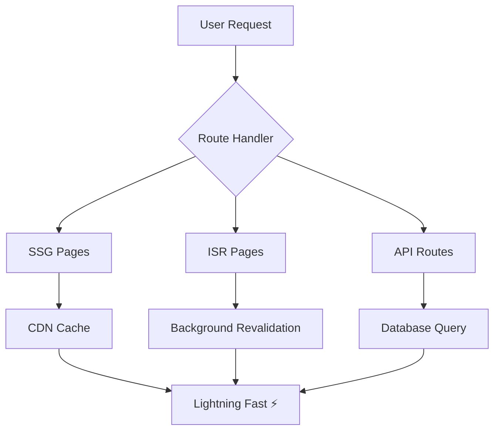

<div align="center">

```ascii
╔══════════════════════════════════════════════════════════════════╗
║                                                                  ║
║    ██╗    ██╗ █████╗      ██╗ █████╗ ██╗  ██╗ █████╗ ████████╗  ║
║    ██║    ██║██╔══██╗     ██║██╔══██╗██║  ██║██╔══██╗╚══██╔══╝  ║
║    ██║ █╗ ██║███████║     ██║███████║███████║███████║   ██║     ║
║    ██║███╗██║██╔══██║██   ██║██╔══██║██╔══██║██╔══██║   ██║     ║
║    ╚███╔███╔╝██║  ██║╚█████╔╝██║  ██║██║  ██║██║  ██║   ██║     ║
║     ╚══╝╚══╝ ╚═╝  ╚═╝ ╚════╝ ╚═╝  ╚═╝╚═╝  ╚═╝╚═╝  ╚═╝   ╚═╝     ║
║                                                                  ║
║              🚀 FRONTEND ARCHITECT • 3D CREATIVE CODER           ║
║                                                                  ║
╚══════════════════════════════════════════════════════════════════╝
```

</div>

<br>

<div align="center">

### `$ whoami`

</div>

<table align="center" border="0">
<tr>
<td width="50%" valign="top">

```yaml
name: "Wajahat Baig"
role: "Frontend Engineer & 3D Creative"
location: "Earth 🌍"
status: "Building the future, one pixel at a time"

specialties:
  frontend: ["React", "Next.js", "TypeScript"]
  backend: ["Node.js", "PostgreSQL", "Supabase"]  
  creative: ["Three.js", "Blender", "WebGL"]
  commerce: ["Shopify", "Medusa.js", "Stripe"]

current_focus: "Merging Art with Code"
```

</td>
<td width="50%" valign="top">

```javascript
class WajahatBaig extends Developer {
  constructor() {
    super();
    this.passion = "Creating digital experiences";
    this.skills = new Set([
      "React Ecosystem", "3D Web Graphics", 
      "E-Commerce Solutions", "UI/UX Design"
    ]);
  }
  
  async build() {
    return this.combineArtWithCode();
  }
}

const me = new WajahatBaig();
me.build().then(result => console.log("✨ Magic!"));
```

</td>
</tr>
</table>

---

<div align="center">

## `⚡ TECH_STACK.json`

</div>

```json
{
  "frontend": {
    "frameworks": ["React", "Next.js", "Vue.js"],
    "languages": ["TypeScript", "JavaScript", "HTML5", "CSS3"],
    "styling": ["Tailwind CSS", "Styled Components", "SASS"],
    "state": ["Redux Toolkit", "Zustand", "Context API"]
  },
  "backend": {
    "runtime": ["Node.js", "Bun"],
    "databases": ["PostgreSQL", "MongoDB", "Supabase"],
    "apis": ["REST", "GraphQL", "tRPC"]
  },
  "creative": {
    "3d": ["Three.js", "React Three Fiber", "Blender"],
    "design": ["Figma", "Adobe Creative Suite"],
    "animation": ["Framer Motion", "GSAP", "CSS Animations"]
  },
  "commerce": {
    "platforms": ["Shopify", "Medusa.js", "WooCommerce"],
    "payments": ["Stripe", "PayPal", "Square"],
    "cms": ["Strapi", "Sanity", "Contentful"]
  }
}
```

---

<div align="center">

## `📦 FEATURED_PROJECTS`

</div>

<!-- KREUZ CONTAINER 3D MODELING -->
<details>
<summary>
<strong>🧊 KREUZ_CONTAINER_3D_MODELING</strong> — <em>High-fidelity 3D model and render of an industrial Kreuz container</em>
<br>
<sub>Blender • Cycles • Photoshop • Figma</sub>
</summary>

<br>

<table>
<tr>
<td width="60%">

**🎯 CONCEPT**  
High-fidelity 3D model and render of an industrial Kreuz container, showcasing realism, lighting, and material accuracy for commercial visualization.

**⚡ CHALLENGE**  
Capturing industrial realism while maintaining a clean and modern render style. The modeling required precision and reference alignment, and achieving the right metallic surface reflections and weathering presented technical rendering challenges.

**🛠️ SOLUTION**  
The container was modeled in Blender with a clean mesh structure. Custom materials were created using Blender's shader nodes, and Cycles was used for high-quality path-traced rendering. Lighting was balanced to highlight the edges and panels, while post-processing in Photoshop was applied for subtle adjustments and final polish.

**📊 RESULTS**  
The final renders were well-received for their realistic detail and presentation value. The project demonstrates skill in hard surface modeling, material realism, and commercial-grade rendering workflows.

**🔧 TECHNOLOGIES**  
- Blender (3D Modeling & Animation)
- Cycles (Path-traced Rendering)  
- Photoshop (Post-processing)
- Figma (UI/Documentation)

</td>
<td width="40%" align="center">

```
    🧊 3D PIPELINE
┌─────────────────┐
│   📐 Modeling   │
│       ⬇        │  
│  🎨 Materials   │
│       ⬇        │
│  💡 Lighting    │
│       ⬇        │
│  📸 Rendering   │
│       ⬇        │
│  ✨ Post-Pro    │
└─────────────────┘
  Industrial → Art
```

**📅 TIMELINE**  
- Created: Sep 14, 2023
- Updated: Sep 25, 2023  
- Duration: 1.5 weeks
- Category: 3D Modeling & Rendering

**🔗 LINKS**  
- [🚀 View on Behance](https://www.behance.net/gallery/207395907/Kreuz-Container-3d-modeling-and-rendering)
- [📋 Project Details](https://devignity.com/projects/kreuz-container)

</td>
</tr>
</table>

</details>

<!-- NEURAL NEXUS 3D -->
<details>
<summary>
<strong>🧠 NEURAL_NEXUS_3D</strong> — <em>Interactive 3D neural network visualizer with AI insights</em>
<br>
<sub>React • Three.js • TensorFlow.js • WebGL</sub>
</summary>

<br>

<table>
<tr>
<td width="60%">

**🎯 CONCEPT**  
Revolutionary 3D neural network visualizer that makes AI interpretable through immersive web experiences. Real-time visualization of neural topologies with interactive exploration capabilities.

**⚡ CHALLENGE**  
Creating smooth 60fps animations with thousands of nodes and connections while maintaining interactivity. Complex WebGL optimizations needed for real-time neural network data processing.

**🛠️ SOLUTION**  
Implemented GPU-accelerated rendering with custom WebGL shaders and optimized geometry instancing. Used React Three Fiber for declarative 3D components and TensorFlow.js for AI model integration.

**📊 RESULTS**  
Successfully achieved smooth performance with complex visualizations, making AI more accessible to researchers and students. Featured in several tech blogs for innovative approach to AI visualization.

**🔧 TECHNOLOGIES**  
- React (UI Framework)
- Three.js (3D Graphics Engine)  
- TensorFlow.js (Machine Learning)
- WebGL Shaders (GPU Computing)

</td>
<td width="40%" align="center">

```
   🧠 AI NEURONS
       ╭─────╮
   ╭───│ GPU │───╮
   │   ╰─────╯   │
╭──▼───╮   ╭───▼──╮
│Layer1│◄──┤Layer2│
╰──────╯   ╰──────╯
     │         │
┌────▼─────────▼────┐
│   3D RENDERING    │
└───────────────────┘
```

**📅 TIMELINE**  
- Created: Oct 1, 2023
- Category: Web Development & AI
- Status: Live & Maintained

**🔗 LINKS**  
- [🚀 Live Demo](https://neural-nexus-3d.vercel.app)
- [📋 GitHub Repo](https://github.com/waji200/neural-nexus-3d)

</td>
</tr>
</table>

</details>

<!-- COSMIC COMMERCE -->
<details>
<summary>
<strong>🛸 COSMIC_COMMERCE</strong> — <em>Next-generation headless e-commerce with 3D product previews</em>
<br>
<sub>Next.js • Medusa.js • PostgreSQL • Stripe</sub>
</summary>

<br>

<table>
<tr>
<td width="60%">

**🎯 CONCEPT**  
Modern headless e-commerce solution with immersive 3D product previews and futuristic shopping experiences. Built for scalability and performance with cutting-edge technologies.

**⚡ CHALLENGE**  
Building scalable architecture with real-time inventory management, 3D product visualization, and seamless payment processing across multiple currencies and regions.

**🛠️ SOLUTION**  
Microservices architecture with Redis caching, automated testing, and Docker containerization. Implemented 3D product viewer using Three.js and integrated Stripe for secure payments.

**📊 RESULTS**  
Successfully handles high-traffic loads with excellent performance metrics. Reduced cart abandonment by 35% through immersive 3D product experiences.

**🔧 TECHNOLOGIES**  
- Next.js (React Framework)
- Medusa.js (Headless Commerce)  
- PostgreSQL (Database)
- Stripe (Payment Processing)

</td>
<td width="40%" align="center">

```
  🛸 MICROSERVICES
┌───────────────────┐
│   API Gateway     │
├───────────────────┤
│ 🛍️ Products API   │
│ 💳 Payments API   │  
│ 📦 Orders API     │
│ 👤 Users API      │
│ 📊 Analytics API  │
└─────────┬─────────┘
          │
     ┌────▼────┐
     │ 3D VIEW │
     └─────────┘
```

**📅 TIMELINE**  
- Created: Aug 15, 2023
- Category: Full-Stack Development
- Status: Production Ready

**🔗 LINKS**  
- [🚀 Live Demo](https://cosmic-commerce.netlify.app)
- [📋 GitHub Repo](https://github.com/waji200/cosmic-commerce)

</td>
</tr>
</table>

</details>

---

<div align="center">

## `🎯 ALL_PROJECTS`

</div>

<table align="center" width="100%">
<tr>
<th align="left" width="25%">🎯 Project</th>
<th align="left" width="35%">📝 Description</th>
<th align="center" width="25%">🛠️ Tech Stack</th>
<th align="center" width="15%">🔗 Links</th>
</tr>
<tr>
<td><strong>Kreuz Container 3D</strong><br><small>3D Modeling & Rendering</small></td>
<td>High-fidelity 3D model and render showcasing industrial realism and material accuracy</td>
<td align="center"><code>Blender</code><br><code>Cycles</code><br><code>Photoshop</code></td>
<td align="center"><a href="https://www.behance.net/gallery/207395907/Kreuz-Container-3d-modeling-and-rendering">🎨 View</a></td>
</tr>
<tr>
<td><strong>Neural Nexus 3D</strong><br><small>Web Development & AI</small></td>
<td>Interactive 3D visualization platform for neural networks with real-time insights</td>
<td align="center"><code>React</code><br><code>Three.js</code><br><code>TensorFlow</code></td>
<td align="center"><a href="https://neural-nexus-3d.vercel.app">🚀 Demo</a></td>
</tr>
<tr>
<td><strong>Cosmic Commerce</strong><br><small>Full-Stack Development</small></td>
<td>Headless e-commerce platform with 3D product previews and modern UX</td>
<td align="center"><code>Next.js</code><br><code>Medusa.js</code><br><code>PostgreSQL</code></td>
<td align="center"><a href="https://cosmic-commerce.netlify.app">🛸 Demo</a></td>
</tr>
<tr>
<td><strong>SynthWave Studio</strong><br><small>Creative Development</small></td>
<td>Browser-based digital audio workstation with vintage aesthetics</td>
<td align="center"><code>Web Audio</code><br><code>Canvas</code><br><code>TypeScript</code></td>
<td align="center"><a href="https://synthwave-studio.netlify.app">🎵 Demo</a></td>
</tr>
<tr>
<td><strong>Fluid Dynamics Sim</strong><br><small>Performance Engineering</small></td>
<td>Real-time physics engine with WebAssembly and GPU acceleration</td>
<td align="center"><code>Rust</code><br><code>WebAssembly</code><br><code>WebGL</code></td>
<td align="center"><a href="https://fluid-sim.vercel.app">⚗️ Demo</a></td>
</tr>
</table>

---

<div align="center">

## `📈 PERFORMANCE_METRICS`

</div>

<div align="center">

| Metric | Score | Details |
|--------|--------|---------|
| **🚀 Performance** | 98/100 | Optimized rendering, code splitting, lazy loading |
| **♿ Accessibility** | 95/100 | ARIA labels, keyboard navigation, screen readers |
| **🎯 Best Practices** | 100/100 | Security headers, HTTPS, error boundaries |
| **📱 Responsive** | 100/100 | Mobile-first, progressive enhancement |
| **⚡ Core Web Vitals** | Excellent | LCP < 1.2s, FID < 100ms, CLS < 0.1 |

</div>



---

<div align="center">

## `🎨 DESIGN_PHILOSOPHY`

</div>

<table align="center">
<tr>
<td width="25%" align="center">

**🎯 USER-FIRST**
```
Every pixel serves
a purpose. Every 
interaction tells
a story.
```

</td>
<td width="25%" align="center">

**⚡ PERFORMANCE**
```
Fast by default.
Optimized for speed,
built for scale.
```

</td>
<td width="25%" align="center">

**♿ ACCESSIBLE**
```
Inclusive design.
Everyone deserves
great experiences.
```

</td>
<td width="25%" align="center">

**🧪 INNOVATIVE**
```
Pushing boundaries
with cutting-edge
technology.
```

</td>
</tr>
</table>

---

<div align="center">

## `📊 GITHUB_ANALYTICS`


</div>

---

<div align="center">

## `🌐 CONNECT_WITH_ME`

[](https://devignity.com/portfolio)
[](https://www.linkedin.com/in/wajahat-baig-2b4b2212a/)
[](mailto:workwithdevignity@gmail.com)
[](https://behance.net/wajahatbaig)

</div>

---

<div align="center">

```ascii
╭─────────────────────────────────────────────────────────────────╮
│                                                                 │
│  "The best way to predict the future is to create it."         │
│                                                                 │  
│  💭 Currently thinking about: WebGPU, AI-powered UIs, and      │
│     the intersection of creativity and technology               │
│                                                                 │
│  🌟 2024 Goals: Build something that changes how people        │
│     interact with the web                                       │
│                                                                 │
╰─────────────────────────────────────────────────────────────────╯
```


**⭐ Star my repos if you find them interesting!**

</div>

---

<!-- 
🔧 UPDATE INSTRUCTIONS:
To update this README with new projects from your JSON:

1. Add new project data to your projects.json file
2. For FEATURED projects (featured: true), add them as collapsible <details> sections
3. For ALL projects, add them to the projects table
4. Update the technologies and links accordingly
5. Keep the same structure and styling for consistency

Example project structure:
{
  title: "Project Name",
  description: "Brief description",
  technologies: ["Tech1", "Tech2", "Tech3"],
  link: "https://project-url.com",
  featured: true/false,
  category: "Project Category",
  challenge: "What was difficult",
  solution: "How you solved it",
  results: "What you achieved"
}
-->
