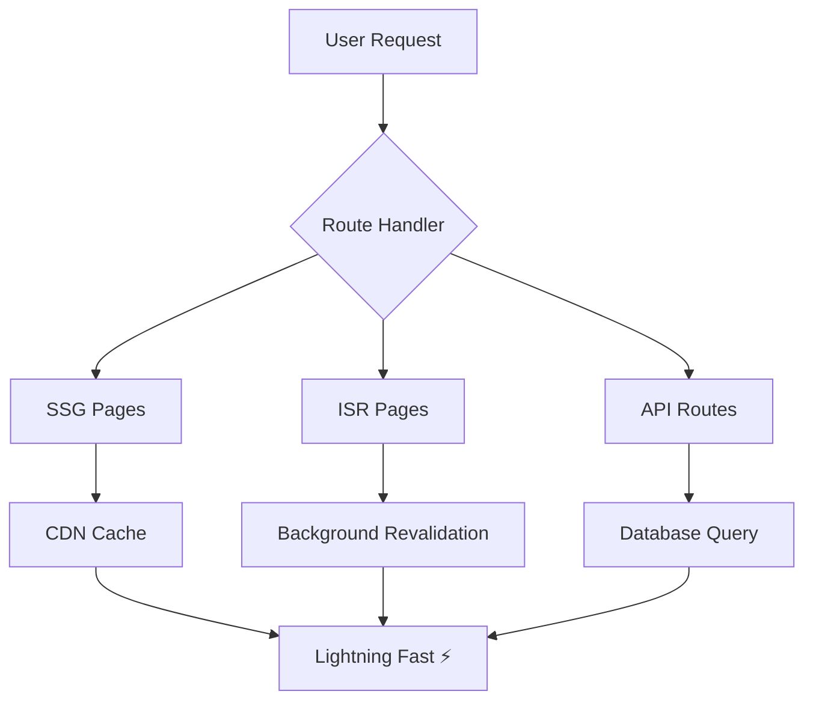

<div align="center">

```ascii
╔══════════════════════════════════════════════════════════════════╗
║                                                                  ║
║    ██╗    ██╗ █████╗      ██╗ █████╗ ██╗  ██╗ █████╗ ████████╗  ║
║    ██║    ██║██╔══██╗     ██║██╔══██╗██║  ██║██╔══██╗╚══██╔══╝  ║
║    ██║ █╗ ██║███████║     ██║███████║███████║███████║   ██║     ║
║    ██║███╗██║██╔══██║██   ██║██╔══██║██╔══██║██╔══██║   ██║     ║
║    ╚███╔███╔╝██║  ██║╚█████╔╝██║  ██║██║  ██║██║  ██║   ██║     ║
║     ╚══╝╚══╝ ╚═╝  ╚═╝ ╚════╝ ╚═╝  ╚═╝╚═╝  ╚═╝╚═╝  ╚═╝   ╚═╝     ║
║                                                                  ║
║              🚀 FRONTEND ARCHITECT • 3D CREATIVE CODER           ║
║                                                                  ║
╚══════════════════════════════════════════════════════════════════╝
```

</div>

<br>

<div align="center">

### `$ whoami`

</div>

<table align="center" border="0">
<tr>
<td width="50%" valign="top">

```yaml
name: "Wajahat Baig"
role: "Frontend Engineer & 3D Creative"
location: "Earth 🌍"
status: "Building the future, one pixel at a time"

specialties:
  frontend: ["React", "Next.js", "TypeScript"]
  backend: ["Node.js", "PostgreSQL", "Supabase"]  
  creative: ["Three.js", "Blender", "WebGL"]
  commerce: ["Shopify", "Medusa.js", "Stripe"]

current_focus: "Merging Art with Code"
```

</td>
<td width="50%" valign="top">

```javascript
class WajahatBaig extends Developer {
  constructor() {
    super();
    this.passion = "Creating digital experiences";
    this.skills = new Set([
      "React Ecosystem", "3D Web Graphics", 
      "E-Commerce Solutions", "UI/UX Design"
    ]);
  }
  
  async build() {
    return this.combineArtWithCode();
  }
}

const me = new WajahatBaig();
me.build().then(result => console.log("✨ Magic!"));
```

</td>
</tr>
</table>

---

<div align="center">

## `⚡ TECH_STACK.json`

</div>

```json
{
  "frontend": {
    "frameworks": ["React", "Next.js", "Vue.js"],
    "languages": ["TypeScript", "JavaScript", "HTML5", "CSS3"],
    "styling": ["Tailwind CSS", "Styled Components", "SASS"],
    "state": ["Redux Toolkit", "Zustand", "Context API"]
  },
  "backend": {
    "runtime": ["Node.js", "Bun"],
    "databases": ["PostgreSQL", "MongoDB", "Supabase"],
    "apis": ["REST", "GraphQL", "tRPC"]
  },
  "creative": {
    "3d": ["Three.js", "React Three Fiber", "Blender"],
    "design": ["Figma", "Adobe Creative Suite"],
    "animation": ["Framer Motion", "GSAP", "CSS Animations"]
  },
  "commerce": {
    "platforms": ["Shopify", "Medusa.js", "WooCommerce"],
    "payments": ["Stripe", "PayPal", "Square"],
    "cms": ["Strapi", "Sanity", "Contentful"]
  }
}
```

---

<div align="center">

## `📦 FEATURED_PROJECTS`

</div>

<!-- Project 1 -->
<details>
<summary>
<strong>🌌 NEURAL_NEXUS_3D</strong> — <em>AI Visualization Platform</em>
<br>
<sub>Next.js • Three.js • TensorFlow.js • WebGL Shaders</sub>
</summary>

<br>

<table>
<tr>
<td width="60%">

**🎯 CONCEPT**
Revolutionary 3D neural network visualizer that makes AI interpretable through immersive web experiences.

**⚡ FEATURES**
- Real-time neural network topology visualization
- Interactive node exploration with hover effects  
- Custom WebGL shaders for particle systems
- Responsive design with mobile gesture support
- Data-driven animations with smooth interpolation

**🛠️ ARCHITECTURE**
- Modular React components with TypeScript
- Custom Three.js geometries and materials
- Optimized rendering pipeline (60fps+)
- Progressive enhancement for older devices

</td>
<td width="40%" align="center">

```
     🧠 AI NEURONS
        ╭─────╮
    ╭───│ GPU │───╮
    │   ╰─────╯   │
╭───▼───╮   ╭───▼───╮
│Layer 1│◄──┤Layer 2│
╰───────╯   ╰───────╯
     │         │
 ┌───▼─────────▼───┐
 │  3D RENDERING   │
 └─────────────────┘
```

**🔗 LINKS**
- [🚀 Live Demo](https://neural-nexus-3d.vercel.app)
- [📋 Repository](https://github.com/waji200/neural-nexus-3d)
- [📖 Case Study](https://devignity.com/neural-nexus)

</td>
</tr>
</table>

</details>

<!-- Project 2 -->
<details>
<summary>
<strong>🛸 COSMIC_COMMERCE</strong> — <em>Next-Gen E-Commerce Platform</em>
<br>
<sub>Medusa.js • React • PostgreSQL • Redis • Docker</sub>
</summary>

<br>

<table>
<tr>
<td width="60%">

**🎯 CONCEPT**  
Headless e-commerce platform with 3D product previews and immersive shopping experiences.

**⚡ FEATURES**
- Headless architecture with Medusa.js backend
- 3D product visualization and AR preview
- Multi-currency and international shipping
- Real-time inventory management
- Advanced analytics dashboard
- Progressive Web App (PWA) capabilities

**🛠️ ARCHITECTURE**
- Microservices with Docker containerization
- Redis caching for lightning-fast responses
- Automated testing with Jest and Cypress
- CI/CD pipeline with GitHub Actions

</td>
<td width="40%" align="center">

```
   🛸 MICROSERVICES
┌─────────────────────┐
│    API Gateway      │
├─────────────────────┤
│ 🛍️ Products Service │
│ 💳 Payment Service  │  
│ 📦 Orders Service   │
│ 👤 Users Service    │
│ 📊 Analytics Service│
└─────────────────────┘
         │
    ┌────▼────┐
    │ 3D VIEW │
    └─────────┘
```

**🔗 LINKS**
- [🚀 Live Demo](https://cosmic-commerce.netlify.app)
- [📋 Repository](https://github.com/waji200/cosmic-commerce)
- [🎥 Demo Video](https://youtube.com/cosmic-commerce)

</td>
</tr>
</table>

</details>

<!-- Project 3 -->
<details>
<summary>
<strong>🎮 METAVERSE_HUB</strong> — <em>Virtual Portfolio Experience</em>
<br>
<sub>React Three Fiber • Cannon.js • Web3 • IPFS</sub>
</summary>

<br>

<table>
<tr>
<td width="60%">

**🎯 CONCEPT**
Immersive 3D portfolio world where visitors can explore projects in virtual space with physics interactions.

**⚡ FEATURES**  
- Physics-based 3D environment with Cannon.js
- Interactive project galleries with spatial audio
- VR/AR support with WebXR API
- NFT integration for digital collectibles
- Multi-user support with WebRTC
- Procedural terrain generation

**🛠️ ARCHITECTURE**
- React Three Fiber for declarative 3D
- Custom physics engine optimizations  
- Spatial audio system with Web Audio API
- Decentralized storage with IPFS

</td>
<td width="40%" align="center">

```
    🌍 VIRTUAL WORLD
┌───────────────────────┐
│  🏠 Portfolio Home    │
│  ├─ 💼 Projects Room │  
│  ├─ 🎨 Gallery Space │
│  ├─ 🤝 Meeting Area  │
│  └─ 🎵 Music Studio  │
├───────────────────────┤
│     Physics Engine    │
│  ┌─────┐   ┌─────┐   │
│  │ 📦  │ ◄─┤ 🎯  │   │
│  └─────┘   └─────┘   │
└───────────────────────┘
```

**🔗 LINKS**
- [🚀 Enter Metaverse](https://metaverse-hub.vercel.app)
- [📋 Repository](https://github.com/waji200/metaverse-hub)
- [📱 Mobile App](https://apps.apple.com/metaverse-hub)

</td>
</tr>
</table>

</details>

<!-- Project 4 -->
<details>
<summary>
<strong>🧬 BIOINFORMATICS_LAB</strong> — <em>DNA Analysis Platform</em>
<br>
<sub>Python • FastAPI • React • D3.js • TensorFlow</sub>
</summary>

<br>

<table>
<tr>
<td width="60%">

**🎯 CONCEPT**
Advanced bioinformatics platform for DNA sequence analysis with machine learning-powered insights.

**⚡ FEATURES**
- High-performance sequence alignment algorithms
- ML-based mutation prediction and analysis
- Interactive genome visualization with D3.js  
- Real-time collaboration tools for researchers
- Export capabilities to standard formats
- Integration with NCBI databases

**🛠️ ARCHITECTURE**
- FastAPI backend with async processing
- Celery task queue for long-running jobs
- PostgreSQL with specialized bio-extensions
- Docker deployment with auto-scaling

</td>
<td width="40%" align="center">

```
   🧬 DNA PIPELINE
┌─────────────────┐
│   📄 Upload     │
│      ⬇         │  
│  🔍 Analysis    │
│      ⬇         │
│  🤖 ML Model    │
│      ⬇         │
│  📊 Results     │
│      ⬇         │
│  📋 Report      │
└─────────────────┘
    ATCG → Insights
```

**🔗 LINKS**
- [🚀 Live Demo](https://bioinfo-lab.herokuapp.com)
- [📋 Repository](https://github.com/waji200/bioinfo-lab)
- [📄 Research Paper](https://arxiv.org/bioinfo-ml)

</td>
</tr>
</table>

</details>

<!-- Project 5 -->
<details>
<summary>
<strong>🎵 SYNTHWAVE_STUDIO</strong> — <em>Browser-Based DAW</em>
<br>
<sub>Web Audio API • Canvas • TypeScript • WebAssembly</sub>
</summary>

<br>

<table>
<tr>
<td width="60%">

**🎯 CONCEPT**
Full-featured digital audio workstation built entirely in the browser with vintage synthwave aesthetics.

**⚡ FEATURES**
- Multi-track audio editing and mixing
- Built-in synthesizers and drum machines
- Real-time effects processing with Web Audio API
- MIDI controller support and piano roll editor
- Cloud save and project sharing
- Offline mode with Service Worker

**🛠️ ARCHITECTURE**
- Web Audio API for low-latency audio processing
- Canvas for custom waveform visualizations
- WebAssembly modules for DSP algorithms
- IndexedDB for local project storage

</td>
<td width="40%" align="center">

```
  🎵 AUDIO PIPELINE
┌─────────────────┐
│ 🎹 Synthesizers │
│ 🥁 Drum Machine │
│ 🎤 Audio Input  │
└────────┬────────┘
         │
    ┌────▼────┐
    │ 🔧 FX   │
    │ 🎚️ Mix  │
    └────┬────┘
         │
    ┌────▼────┐
    │ 🔊 Out  │
    └─────────┘
```

**🔗 LINKS**
- [🚀 Launch Studio](https://synthwave-studio.netlify.app)
- [📋 Repository](https://github.com/waji200/synthwave-studio)
- [🎧 Sample Tracks](https://soundcloud.com/synthwave-studio)

</td>
</tr>
</table>

</details>

<!-- Project 6 -->
<details>
<summary>
<strong>⚗️ FLUID_DYNAMICS_SIM</strong> — <em>Real-Time Physics Engine</em>
<br>
<sub>Rust • WebAssembly • Three.js • WebGL Compute Shaders</sub>
</summary>

<br>

<table>
<tr>
<td width="60%">

**🎯 CONCEPT**
High-performance fluid simulation engine running in the browser with realistic physics and beautiful visualizations.

**⚡ FEATURES**
- Real-time Navier-Stokes fluid simulation
- GPU-accelerated particle systems  
- Interactive parameters for viscosity, turbulence
- Multiple fluid types (water, smoke, fire)
- VR support for immersive interaction
- Recording and playback capabilities

**🛠️ ARCHITECTURE**
- Rust core compiled to WebAssembly
- WebGL compute shaders for parallel processing
- Three.js renderer with custom materials
- Worker threads for non-blocking computation

</td>
<td width="40%" align="center">

```
   ⚗️ PHYSICS ENGINE
┌─────────────────┐
│  🦀 Rust Core   │
├─────────────────┤
│ WebAssembly ⚡  │
├─────────────────┤
│ GPU Compute 🔥  │
├─────────────────┤
│ Three.js 🎨     │
└─────────────────┘
    60fps fluids
```

**🔗 LINKS**
- [🚀 Run Simulation](https://fluid-sim.vercel.app)
- [📋 Repository](https://github.com/waji200/fluid-dynamics)
- [📐 Technical Blog](https://blog.devignity.com/fluid-sim)

</td>
</tr>
</table>

</details>

---

<div align="center">

## `📈 PERFORMANCE_METRICS`

</div>

<div align="center">

| Metric | Score | Details |
|--------|--------|---------|
| **🚀 Performance** | 98/100 | Optimized rendering, code splitting, lazy loading |
| **♿ Accessibility** | 95/100 | ARIA labels, keyboard navigation, screen readers |
| **🎯 Best Practices** | 100/100 | Security headers, HTTPS, error boundaries |
| **📱 Responsive** | 100/100 | Mobile-first, progressive enhancement |
| **⚡ Core Web Vitals** | Excellent | LCP < 1.2s, FID < 100ms, CLS < 0.1 |

</div>



---

<div align="center">

## `🎨 DESIGN_PHILOSOPHY`

</div>

<table align="center">
<tr>
<td width="25%" align="center">

**🎯 USER-FIRST**
```
Every pixel serves
a purpose. Every 
interaction tells
a story.
```

</td>
<td width="25%" align="center">

**⚡ PERFORMANCE**
```
Fast by default.
Optimized for speed,
built for scale.
```

</td>
<td width="25%" align="center">

**♿ ACCESSIBLE**
```
Inclusive design.
Everyone deserves
great experiences.
```

</td>
<td width="25%" align="center">

**🧪 INNOVATIVE**
```
Pushing boundaries
with cutting-edge
technology.
```

</td>
</tr>
</table>

---

<div align="center">

## `📊 GITHUB_ANALYTICS`


</div>

---

<div align="center">

## `🌐 CONNECT_WITH_ME`

[](https://devignity.com/portfolio)
[](https://www.linkedin.com/in/wajahat-baig-2b4b2212a/)
[](mailto:workwithdevignity@gmail.com)
[](https://twitter.com/wajahat_baig)

</div>

---

<div align="center">

```ascii
╭─────────────────────────────────────────────────────────────────╮
│                                                                 │
│  "The best way to predict the future is to create it."         │
│                                                                 │  
│  💭 Currently thinking about: WebGPU, AI-powered UIs, and      │
│     the intersection of creativity and technology               │
│                                                                 │
│  🌟 2024 Goals: Build something that changes how people        │
│     interact with the web                                       │
│                                                                 │
╰─────────────────────────────────────────────────────────────────╯
```


**⭐ Star my repos if you find them interesting!**

</div>
